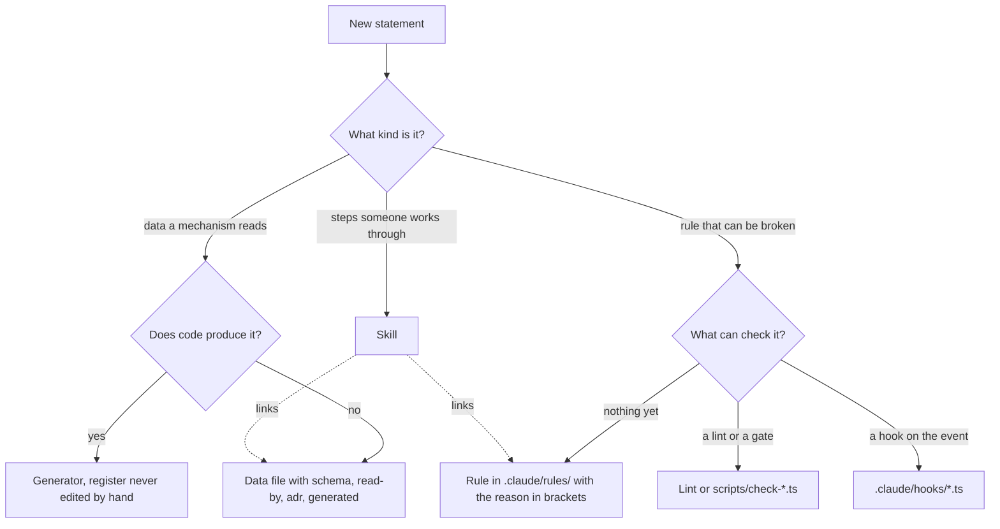

# ADR 0001 — Every statement has exactly one carrier, chosen by its kind

<!-- STATE:BEGIN — generated by generate-adr-state from the frontmatter. Do not edit by hand. -->
<!-- STATE:END -->

> **In short.** In the context of a new public repo whose setup starts with rules, skills, hooks and data files,
> facing the risk that the same statement ends up in several places and drifts apart, we decided for exactly one
> carrier per statement, chosen by the kind of statement, with a template and a structure gate per carrier, and
> against prose that is cleaned up by hand, to keep every statement where a mechanism can hold it, accepting that
> every new file starts from a template, however short it is.

## Context and problem

Pixecutive starts its setup on 2026-10-03 with an empty repo: `LICENSE` and `README.md`. Everything a session needs
will be written now: rules in `.claude/rules/`, skills, agents, hooks in `.claude/hooks/`, gates in `scripts/`, data
files in `.claude/data/`. The repo is public and will later be developed by a Pixecutive instance, so the setup has
to explain itself and has to stay correct without someone remembering where each statement lives.

A statement that stands in two places is read in one and changed in the other. A rule that only stands in prose is
read and still broken. This ADR decides where a statement goes and how the carriers stay small and checkable; the
single mechanisms are decided in their own ADRs.

## Decision drivers

- A statement must live in exactly one place, or it drifts.
- A rule that can be broken needs something that notices when it is broken.
- What is loaded into every session costs context, so it needs a measured upper limit.
- A register that a script can write must not depend on someone keeping it current by hand.

## Considered options

- **A — One carrier per statement, chosen by kind**, each carrier with a template and a structure gate.
- **B — Free prose in `CLAUDE.md` and the skills**, kept tidy by review.
- **C — Prose plus gates that compare prose against the code.**

## Decision

Chosen: **A**, because B leaves every rule to discipline and C reads prose, which gives false alarms; a gate with
false alarms is switched off, not obeyed ([ADR 0008](0008-testing-and-gates.md)).

1. **The kind of a statement decides its carrier.** Steps someone works through go into a skill. A rule that can be
   broken goes into a rule, a hook or a lint. Data a mechanism reads goes into a data file with `schema`, `read-by`,
   `adr` and `generated` frontmatter, or comes from a generator. A skill never repeats a rule or a data set; it
   links them. `[Gate check-skills · Gate check-carriers]`
2. **Every rule names its mechanism in brackets.** A rule without one says why none is possible.
   `[Gate check-rules]`
3. **Every carrier has a template in `.claude/templates/`** (`rule.md`, `skill.md`, `agent.md`, `data.md`,
   `hook.ts`, `unit-readme.md`). Each template ends with an EXCLUDED block that names what does not belong in it and
   which carrier takes it instead. A structure gate checks the required fields of each carrier, not its content.
   `[Gate check-carriers · Gate check-skills]`
4. **Rules live in `.claude/rules/` and only there.** `basis` and `workflow` have no `paths:` and are always loaded.
   Every other rule loads through its `paths:` when a matching file is read, and on the first write in its area a
   hook injects the rule's `summary`, at most 60 words. `[Hook rule-context · Gate check-rules]`
5. **The rules loaded at one moment stay within 1 % of the context window.** Counted is what actually lies in the
   context: `CLAUDE.md`, `basis`, `workflow` and every rule whose `paths:` match the open file. Exceeding it is a
   fault in how the rules are cut, not in the budget. `[Gate check-rules]`
6. **Every document belongs to one class, and the class decides its lifetime.** Canon is what `CLAUDE.md` names and
   is maintained. Analysis lives in `docs/research/` and is frozen on its date. Ephemeral documents live in
   `docs/plans/` and die once their purpose is fulfilled. A gate may report a file as overdue; only the maintainer
   removes it, with the output of `find-references` as evidence. `[Gate find-references · Skill decision-sheet]`
7. **Generated registers are never edited by hand.** The skills register is written by `generate-skills-index`, the
   ADR state tables by `generate-adr-state`; pre-commit regenerates them and rejects a difference.
   `[Gate check-generated · Hook pre-commit]`
8. **Memory holds incidents, preferences, project state and pointers, never a rule.** A rule written into memory
   is a second copy that no gate reads. `[Hook memory-guard · Gate check-memory]`
9. **A new rule exists only with the maintainer's yes.** A rule is loaded every time it applies; it is the most
   expensive place in the project. `[Skill decision-sheet · Prose: whether the maintainer agreed is not
   measurable by a gate]`

### Consequences

- Good, because every statement has one owner, and a duplicate is a finding, not a style question.
- Good, because the EXCLUDED blocks route a misplaced statement to its carrier instead of repeating the routing.
- Good, because the rule budget is a number that can turn red, not an impression.
- Bad, because every new carrier needs a template first, even a short one.
- Bad, because point 9 rests on the maintainer's answer; a gate can see a new rule, not the agreement behind it.

### Confirmation

`check-rules` turns red on a rule without mechanism, a summary over 60 words, a duplicated rule and a budget over
1 %. `check-carriers` and `check-skills` turn red when a required field of a template is removed. `check-generated`
turns red when a generated register is changed by hand. `check-memory` turns red on a rule in memory. Each gate has
a probe registered in `.claude/data/precommit-checks.tsv` that plants the violation and fixes it again.

## Mechanics

How a new statement finds its carrier.

## Rejected

- **B — free prose kept tidy by review.** Leaves every rule to discipline; a rule read and broken stays broken.
- **C — gates that compare prose against code.** Reads text, gives false alarms, and is switched off.
- **Loading every rule always.** Pays for every area in every session and has no limit that can turn red.
- **Rules in memory as a reminder.** A second copy outside every gate.
- **Editing a register by hand when the generator lags.** Two sources for one list; the generator is the source.
