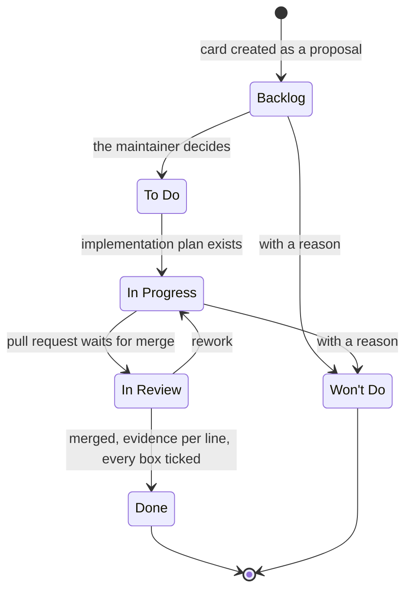

# ADR 0002 — A feature goes through four stages, and the card is its specification

<!-- STATE:BEGIN — generated by generate-adr-state from the frontmatter. Do not edit by hand. -->
<!-- STATE:END -->

> **In short.** In the context of a repo that is built by Claude sessions and accepted by one maintainer, facing
> work that starts before anyone wrote down what is to be built, we decided for four stages from product plan to
> code, with the Jira card as the accepted specification and the maintainer's merge as the acceptance, and against
> building from a chat request, to make every built line traceable to a decided requirement, accepting that even
> small features start with a card and a plan.

## Context and problem

Pixecutive is written by Claude sessions and decided by the maintainer. A session can produce code faster than the
maintainer can check it against an intention that only existed in a chat. What was asked for and what was built
then differ, and nobody can tell from the repo which of the two was meant.

The repo is public and will be developed later by a Pixecutive instance, so the flow has to be written down and
enforced in the repo itself. Tasks live in Jira project `PIX`; the site and every status, transition and type ID
come from the local config, never from this repo.

## Decision drivers

- What is built must be traceable to a requirement the maintainer decided.
- A question to the maintainer must be answerable without reconstructing the session.
- Work that cannot succeed without something only the maintainer can provide must not be built around the gap.
- The maintainer accepts once, where the diff is visible.

## Considered options

- **A — Four stages with the card as specification**, decision sheets for questions, review before the pull
  request, the merge as acceptance.
- **B — Build directly from the request in the chat**, with a plan only for large work.
- **C — Product plan and implementation plan merged into one document.**

## Decision

Chosen: **A**, because only a card with an acceptance list and a plan that repeats it verbatim gives something the
diff can be held against.

1. **Four stages.** A product plan says what and why and lists what is out of scope with reasons; it ends in cards.
   Each card carries an acceptance list, its parent epic set on creation, a `typ:` label, and starts in Backlog.
   Each card gets one implementation plan under `docs/plans/impl/` with the acceptance verbatim, an inventory of
   what exists, is extended or is new, ordered steps that each end green, and a test plan. Then code.
   `[Skill plan · Skill ticket · Skill implementation-plan · Skill code]`
2. **The card lifecycle on PIX.** Backlog is a proposal; To Do is decided by the maintainer; In Progress means
   someone works on it now; In Review means its pull request waits for the merge; Done means merged, with evidence
   per acceptance line; Won't Do carries a reason. Types are Epic, Task and Bug. Statuses and transitions are
   addressed by ID from the local config. `[Hook guard-inprogress · Hook guard-done · Config
   pixecutive.local.schema.json]`
3. **One open card per session, cards one after another.** A series of cards shares one branch and one pull
   request. `[Gate ticket.ts open · Hook require-ticket]`
4. **The card is the specification.** Every acceptance line stands verbatim in the plan; a line that looks wrong is
   checked at its source and asked about in the card, never dropped. What changes on the way goes into card and
   plan. `[Hook guard-done · Skill implementation-plan]`
5. **Every proposal and question to the maintainer goes out as an interactive decision sheet.** Each item names the
   finding, what I would do and why. The answers are read back and go into the ADR and the card or plan.
   `[Skill decision-sheet]`
6. **A missing prerequisite is reported in the first sentence and stops the work.** What only the maintainer can
   provide is asked for plainly; nothing is built around it. `[Prose: whether something is a prerequisite is a
   judgment no hook can make before the work starts]`
7. **An independent run in a fresh context reviews the diff before the pull request.** Its report goes to the
   maintainer as a sheet; a third run needs the maintainer's yes. `[Agent adversarial-review · Hook
   gate-before-pr]`
8. **The maintainer's merge is the acceptance.** The model never merges. After the merge the card goes to Done with
   evidence per acceptance line as a comment. `[Hook guard-shell · Hook guard-done]`

How a write is bound to the open card is decided in [ADR 0003](0003-no-write-without-ticket.md); branches, commits
and the push in [ADR 0004](0004-git-flow-and-history-guard.md).

### Consequences

- Good, because every line of a diff can be held against an acceptance line, and a missing line is visible.
- Good, because the maintainer decides once on the card and once at the merge, not again after it.
- Good, because a series of cards keeps its context in one session without two cards open at once.
- Bad, because a small feature still needs a card and a plan; bugs and hotfixes need no plan
  ([ADR 0003](0003-no-write-without-ticket.md)).
- Bad, because a pull request for a series is larger than one per card.

### Confirmation

`guard-inprogress` rejects the transition to In Progress for a card type that needs a plan when no plan exists.
`guard-done` rejects Done while the plan has an open box. `require-ticket` rejects a write to a protected path with
no open card. `gate-before-pr` rejects opening a pull request before the review ran. Each hook has a probe that
turns it red and green, registered in `.claude/data/precommit-checks.tsv`.

## Mechanics

The lifecycle of a card on PIX.

## Rejected

- **B — build from the chat request.** What was asked and what was built cannot be compared afterwards.
- **C — one document for product plan and implementation plan.** The acceptance list would come from a document
  that is no longer maintained once its cards exist.
- **Several open cards per session.** Which card a write belongs to would be guessed again.
- **A new session per card.** A series would read the same context again for every card.
- **A second yes after the merge.** Asks the maintainer twice for what the merge already decided.
- **Done when the pull request opens.** Before the merge nothing is accepted.
