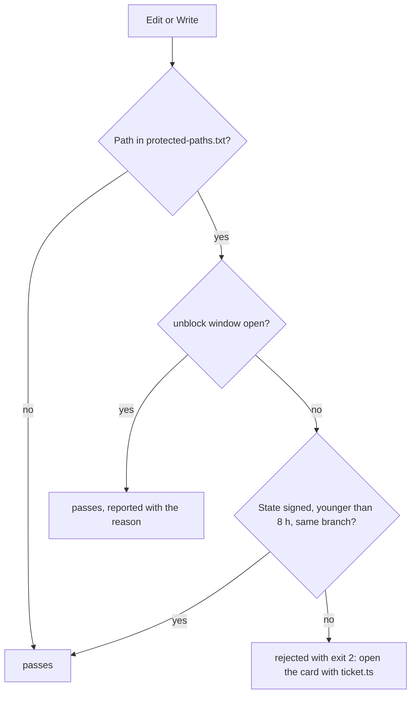

# ADR 0003 — No write to a protected path without an open ticket, held by a signed state machine

<!-- STATE:BEGIN — generated by scripts/generate-adr-state.ts from the frontmatter; never edit by hand. -->

|                     |                                                                        |
| ------------------- | ---------------------------------------------------------------------- |
| **Status**          | accepted                                                               |
| **Date**            | 2026-10-03                                                             |
| **Kind**            | workflow                                                               |
| **Decision-makers** | lradermacher                                                           |
| **Supersedes**      | —                                                                      |
| **Superseded by**   | —                                                                      |
| **Analysis**        | —                                                                      |
| **Implementation**  | [PLAN_PIX-1_claude-setup.md](../plans/impl/PLAN_PIX-1_claude-setup.md) |
| **Cards**           | PIX-1                                                                  |

<!-- STATE:END -->

> **In short.** In the context of the feature flow in ADR 0002, facing a flow that only holds as long as a session
> remembers to follow it, we decided for a state machine in `scripts/ticket.ts` that binds every write to a
> protected path to one open, signed work package, with a short escape window only the maintainer opens, and
> against a flow kept by discipline or a block without exit, to make "just build something" impossible rather than
> discouraged, accepting that every change to a protected path starts with opening its card.

## Context and problem

[ADR 0002](0002-feature-flow.md) makes the card the specification and the implementation plan its working copy. As
prose, both are steps a session can skip: a file is written before the card is open, a card goes to In Progress
without a plan, or to Done with boxes still open. Pixecutive is public and will be developed later by a Pixecutive
instance, so the flow has to hold without the maintainer watching each session.

A PreToolUse hook that exits with code 2 prevents a write; a hook after the write can only report it. The hook needs
a state it can trust, and the model must not be able to write that state itself.

## Decision drivers

- The most frequent failure is building without a decided requirement; it has to be impossible, not named.
- The state that permits a write must not be writable by the one whose writes it permits.
- A block without a visible way out creates pressure to switch the mechanism off.
- Entry and exit of a card both need a mechanism; an exit that is only asked about does not hold.

## Considered options

- **A — A signed state machine with an escape window** that only the maintainer opens.
- **B — Discipline:** the flow stands in the rules and the skills.
- **C — A block without escape.**

## Decision

Chosen: **A**, because B leaves the flow to memory and C makes every quick check impossible, which leads to
switching the block off as a whole.

1. **`scripts/ticket.ts` is the only writer of `.claude/state/`.** The state is HMAC-signed with a key outside the
   repo. A model command that touches `.claude/state/` is rejected. `[Hook guard-state · Gate ticket.ts]`
2. **One open work package per session.** It carries the card key in the form `PIX-NNN`, expires after 8 hours,
   and is valid only while the current branch matches the one it was opened on. Opening a second card while one is
   open is rejected. `[Gate ticket.ts open]`
3. **A write to a protected path needs an open work package.** Protected is what is shipped or configures what is
   shipped, including `.claude/**`. The criterion is the decision; the path set is its application and stands only
   in `.claude/data/protected-paths.txt`, which the hook reads. `[Hook require-ticket · Config protected-paths.txt]`
4. **The escape is `/unblock <reason>`, typed only by the maintainer.** It opens a 45-minute window in which writes
   pass and are reported with the reason. The skill cannot be invoked by the model, and the model never opens a
   window itself. `[Skill unblock · Hook unblock-window · Hook guard-state]`
5. **In Progress requires an implementation plan.** The transition is rejected while no plan exists under
   `docs/plans/impl/`, unless the card's type needs none; bug and hotfix need none. Which type needs a plan stands
   in `.claude/data/ticket-types.tsv`. `[Hook guard-inprogress · Config ticket-types.tsv]`
6. **Done requires every box in the plan to be ticked.** The plan carries the acceptance verbatim from the card, so
   an open `- [ ]` is countable without a call to Jira. `[Hook guard-done · Gate ticket.ts close]`
7. **No exception by size.** A one-line change to a protected path is exactly the class of change this prevents.
   `[Hook require-ticket]`

### Consequences

- Good, because a write to a protected path without a decided card is no longer possible, whatever the session
  remembers.
- Good, because the state cannot be forged by the model: it cannot write the folder, and a hand-made file fails the
  signature.
- Good, because the exit is mechanical too: a card with an open box does not reach Done.
- Bad, because every change to a protected path starts with opening its card, and a wrong branch means a new
  branch.
- Bad, because the window is a real hole for 45 minutes; it is visible in every write it lets through.
- Paths outside the protected set stay free; what belongs to it is decided by the criterion in point 3, not by
  convenience.

### Confirmation

`require-ticket` rejects a write to a protected path without state and lets the same write pass with a valid state.
`guard-state` rejects a model command that writes `.claude/state/`. `ticket.ts` rejects a state with a broken
signature, an expired one and one from another branch. `unblock-window` lets writes pass inside the window and
rejects them after it. `guard-inprogress` and `guard-done` reject their transitions without a plan and with an open
box. Each has a probe that turns it red and green, registered in `.claude/data/precommit-checks.tsv`.

## Mechanics

What happens on a write.

## Rejected

- **B — discipline.** The flow would hold exactly as long as each session remembers it.
- **C — a block without escape.** Makes every quick check impossible and invites switching the hook off.
- **An exception for small changes.** The one-line change is the failure this prevents.
- **An environment variable as the escape.** It is set once for the whole process and is not tied to a reason or a
  time limit.
- **State the model may write.** The model would sign off its own permission.
- **A path list inside the hook.** A second copy of `protected-paths.txt` that drifts.
