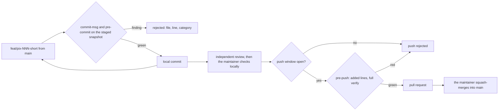

# ADR 0004 — Trunk-based git flow with local commits and a history guard before commit and push

<!-- STATE:BEGIN — generated by scripts/generate-adr-state.ts from the frontmatter; never edit by hand. -->

|                     |                                                                        |
| ------------------- | ---------------------------------------------------------------------- |
| **Status**          | accepted                                                               |
| **Date**            | 2026-10-04                                                             |
| **Kind**            | workflow                                                               |
| **Decision-makers** | lradermacher                                                           |
| **Supersedes**      | —                                                                      |
| **Superseded by**   | —                                                                      |
| **Analysis**        | —                                                                      |
| **Implementation**  | [PLAN_PIX-1_claude-setup.md](../plans/impl/PLAN_PIX-1_claude-setup.md) |
| **Cards**           | PIX-1                                                                  |

<!-- STATE:END -->

> **In short.** In the context of a public repo whose history can never be taken back once pushed, facing commits
> written by Claude sessions that may carry secrets, private names, local paths or host-derived mails, we decided
> for a trunk-based flow with commits that stay local until the pull request is ready and a history guard that runs
> before a commit exists and before a push, and against Git Flow and against relying on the hosting platform's push
> protection alone, to keep anything private out of a public history, accepting a slower commit and a single push
> per branch.

## Context and problem

Pixecutive is public from its first commit. Whatever reaches the remote is copied, forked and indexed; removing it
later means rewriting history that others already hold. Commits are written mostly by Claude sessions, in a
checkout on the maintainer's machine, where secrets, the operator's private names, local paths and host-derived
author mails are all within reach.

Secret scanning on the hosting platform knows secrets, but not the names and paths that are private to one
operator. Those come from the gitignored local config and can only be checked locally.

## Decision drivers

- Nothing private may reach the public history, because it cannot be removed from there.
- A check that runs after the commit exists is too late for the local history and the next push.
- The guard's own output must not repeat what it found.
- The maintainer reviews a finished branch once, not every intermediate step on the remote.

## Considered options

- **A — Trunk-based, local commits, history guard on commit and push**, the branch pushed once when ready.
- **B — Git Flow with `develop` and release branches.**
- **C — Rely on the platform's push protection** and push every step.

## Decision

Chosen: **A**, because only a local guard knows the operator's private values, and only a single push after the
maintainer's local check keeps unreviewed work off the remote.

1. **Trunk-based with a protected `main`.** A pull request is required, checks must be green, merges are squash
   only, no force push. Branches are named `feat/pix-NNN-short` and start from `main`; a series of cards shares one
   branch and one pull request. `[Hook pre-commit · Planned PIX-9: Config GitHub ruleset]`
2. **Conventional Commits with the card as scope**, exactly one `Co-Authored-By` line and at most two text lines.
   `[Hook commit-msg]`
3. **Commits stay local while a card is in progress.** Each green step is committed; the branch is pushed once,
   when its pull request is ready. `[Hook pre-push · Hook push-window]`
4. **The maintainer checks the branch locally before the pull request opens.** Only the maintainer's yes opens the
   push window; a push from a Claude session without an open window is rejected. `[Skill push · Hook push-window]`
5. **The model never merges; merges are squash merges.** `[Hook guard-shell · Planned PIX-9: Config GitHub ruleset]`
6. **A lock on `main`.** No commit on `main` and no push that moves `main`. The lock lives in git hooks installed
   into the shared `.git` directory through `core.hooksPath`, so every worktree has it; the install script fails
   loudly when it cannot install them. Setting `core.hooksPath` or passing `--no-verify` from a session is
   rejected. `[Hook pre-commit · Hook pre-push · Hook guard-shell]`
7. **pre-commit checks a snapshot of exactly the staged state.** It runs a secret scan, the private denylist from
   the local config, an author-mail check that rejects host-derived mails, a check for forbidden paths such as
   `.env` and the local config, a check that admits images and videos only as PNG or SVG product assets under
   `apps/web/assets/` of at most 256 KB each (decided 2026-10-04), and every gate registered in
   `.claude/data/precommit-checks.tsv`.
   `[Hook pre-commit · Config precommit-checks.tsv]`
8. **pre-push scans every added line of every pushed commit**, for secrets, denylisted strings and images outside
   the asset rule, and then runs the full verify. `[Hook pre-push]`
9. **A finding names file, line and category, never the matched text.** The output of a guard lands in terminals,
   session transcripts and later in CI logs; printing the match would publish what the guard just stopped.
   `[Hook pre-commit · Hook pre-push]`
10. **The platform adds a second layer:** secret scanning with push protection (PIX-9), and CI on every pull request
    including forks (PIX-7). `[Planned PIX-9: Config GitHub ruleset · Planned PIX-7: Gate CI]`

### Consequences

- Good, because a private value is stopped before the commit exists, not after it reached the remote.
- Good, because the guard checks the staged snapshot, not the working tree, so what passes is exactly what is
  committed.
- Good, because the remote sees one finished branch per pull request, already checked by the maintainer.
- Bad, because every commit pays for the secret scan and the registered gates, and every push for the full verify.
- Bad, because local commits exist only on one machine until the push; losing the checkout loses them.
- The denylist itself is operator data and never enters this repo; how it is supplied is decided in
  [ADR 0013](0013-local-operator-configuration.md).

### Confirmation

Each git hook has a probe run in a throwaway repo: `commit-msg` rejects a subject without a type, a second
`Co-Authored-By` line and a third text line; `pre-commit` rejects a staged secret, a denylisted string, a
host-derived author mail and a staged `.env`, and prints file, line and category without the match; `pre-push`
rejects a pushed commit with an added secret line and a push that moves `main`. `push-window` rejects a push without
an open window. The probes are registered in `.claude/data/precommit-checks.tsv`.

## Mechanics

The way of a change from the first commit to `main`.

## Rejected

- **B — Git Flow with `develop` and release branches.** Two long-lived branches for one maintainer and no release
  train; every change crosses an extra merge.
- **C — the platform's push protection alone.** It does not know the operator's private names, paths or mails, and
  it acts after the commit exists.
- **Pushing every small step.** Puts unreviewed intermediate states on a public remote, each one a chance to leak.
- **Printing the matched text in a finding.** The log would carry the secret the guard stopped.
