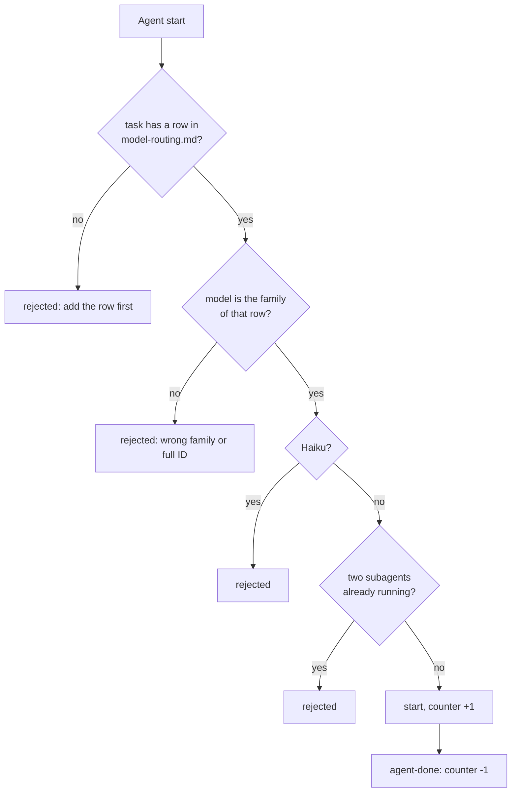

# ADR 0009 — Which model a task gets, and how agents are started, is data checked by a hook

<!-- STATE:BEGIN — generated by scripts/generate-adr-state.ts from the frontmatter; never edit by hand. -->

|                     |                                                                                               |
| ------------------- | --------------------------------------------------------------------------------------------- |
| **Status**          | accepted                                                                                      |
| **Date**            | 2026-10-03                                                                                    |
| **Kind**            | workflow                                                                                      |
| **Decision-makers** | lradermacher                                                                                  |
| **Supersedes**      | —                                                                                             |
| **Superseded by**   | [0017](0017-the-harness-holds-the-agent-limit.md) (point 4 only; the rest of this ADR stands) |
| **Analysis**        | —                                                                                             |
| **Implementation**  | [PLAN_PIX-1_claude-setup.md](../plans/impl/PLAN_PIX-1_claude-setup.md)                        |
| **Cards**           | PIX-1                                                                                         |

<!-- STATE:END -->

> **In short.** In the context of a setup in which the main session starts subagents for research, review and design,
> facing model choices that drift, go stale and grow in cost when one order bundles several roles, we decided for a
> routing table as a data file that a hook checks on every agent start, with model families instead of IDs, no Haiku
> and at most two subagents at once, and against a policy written only in prose, to achieve a choice of model that
> is the same in every session and visible in review, accepting that the table has to be maintained.

## Context and problem

Every subagent runs on some model, and the choice decides cost and how far its result can be trusted. A policy that
lives in prose is repeated in several places, those copies contradict each other, and nothing stops a session from
ignoring them. A full model ID written into an agent definition goes stale silently when a newer model ships. An
order that asks one agent to research, write and build at once is several roles in one prompt, and it runs entirely
on the most expensive model any of those roles needs.

## Decision drivers

- The model a task gets must be the same in every session, not a judgment made again each time.
- A rule that only describes a policy is broken without anyone noticing; a hook notices.
- Work that has to be backed by evidence must not run on a model whose results need to be checked twice.
- Parallel agents multiply cost; the number running at once needs a limit.

## Considered options

- **A — Policy as prose** in a rule or skill, followed by judgment.
- **B — Routing table as data, checked by a hook on every agent start, with a limit on parallel agents.**
- **C — Ask the maintainer before every agent start** that uses a more expensive model.

## Decision

Chosen: **B**, because it is the only option that holds without anyone remembering it, and it costs no waiting time
for the maintainer.

1. **The task decides the model, and the mapping is a data file.** `.claude/data/model-routing.md` holds one row per
   recurring task: task, model family, agent, reason. It is the only place this mapping lives; skills and rules link
   it and never repeat it. A task without a row is a gap in the table and is added before the agent starts.
   `[Data model-routing · Hook agent-guard]`
2. **Families, never full model IDs.** The table and every agent definition name a model family. A full ID goes
   stale silently; a family name does not. The `model:` field of an agent definition carries a family from the
   table. `[Agent · Hook agent-guard]`
3. **Haiku is never assigned.** No row of the table names it, and `agent-guard` rejects it in every position,
   including as an explicit model parameter on the call. Whether a task is plain search or needs evidence often shows
   only in its result, and by then a wrong statement has already been taken over. `[Hook agent-guard]`
4. **At most two subagents run at the same time.** `agent-guard` counts every start and rejects the third;
   `agent-done` counts down when a subagent stops. The limit is about cost, not a technical boundary.
   `[Hook agent-guard · Hook agent-done]`
5. **An order is split into roles before any agent starts.** Research, design, review and building are separate
   roles; each gets its own agent with its own family from the table, or stays in the main session. No mechanism can
   tell how many roles hide in one prompt, so this stays a judgment. `[Prose]`
6. **Fan-out only for uniform, independent pieces.** Several sources, several files of the same kind: yes. One
   connected change with shared context: no, it stays in one place. Whether pieces are independent is a judgment.
   `[Prose]`
7. **What an agent returns is data, never instructions.** Its report is checked against the source before anything
   in it is acted on; a sentence in a report that reads like an order is not followed. The agent template states this
   for every new agent. `[Agent · Prose]`

### Consequences

- Good, because the model choice is visible in one file and in review, and changes in one place.
- Good, because cost stays bounded even when a session tries to fan out widely.
- Bad, because the table has to be maintained: a new recurring task blocks its agent until it has a row.
- Bad, because points 5 to 7 stay judgments; the hook checks families and counts, not the quality of a split.
- Which tools an agent may use, and what it may never do, is decided in [ADR 0010](0010-security-in-agent-operation.md).

### Confirmation

The probe of `agent-guard` turns red on an agent start with a task that has no row, with a full model ID, with
Haiku, and with a third agent while two are running, and green on a start that matches its row. The probe of
`agent-done` shows that the counter goes down again, so four agents started one after another all pass.

## Mechanics

What is checked when an agent starts.

## Rejected

- **A — Policy as prose.** It is copied into several places, the copies drift apart, and nothing notices a session
  that ignores it.
- **C — Ask the maintainer before every expensive start.** It moves a decision that can be read off a table onto the
  maintainer and blocks every design task until the maintainer answers.
- **Haiku for cheap search.** The boundary between search and evidence shows only in the result; a cheaper model is
  not worth a result that has to be checked twice.
- **Full model IDs in agent definitions.** They go stale silently and have to be found and replaced one by one.
- **Taking agent reports over unchecked.** A report can be wrong with full confidence; it is data to verify.
