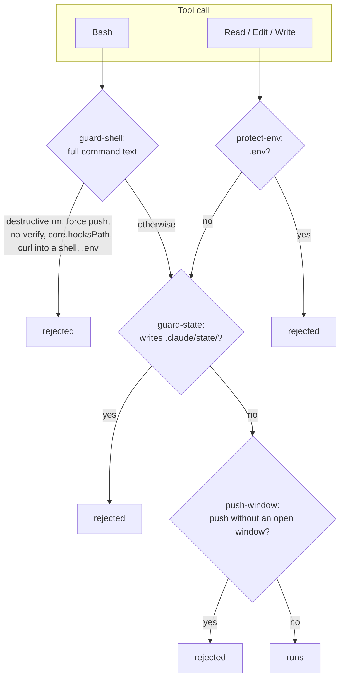

# ADR 0010 — Security in agent operation: hooks draw the boundary, not permission prompts

<!-- STATE:BEGIN — generated by scripts/generate-adr-state.ts from the frontmatter; never edit by hand. -->

|                     |                                                                        |
| ------------------- | ---------------------------------------------------------------------- |
| **Status**          | accepted                                                               |
| **Date**            | 2026-10-03                                                             |
| **Kind**            | workflow                                                               |
| **Decision-makers** | lradermacher                                                           |
| **Supersedes**      | —                                                                      |
| **Superseded by**   | [0016](0016-which-skills-only-the-maintainer-starts.md)                |
| **Analysis**        | —                                                                      |
| **Implementation**  | [PLAN_PIX-1_claude-setup.md](../plans/impl/PLAN_PIX-1_claude-setup.md) |
| **Cards**           | PIX-1                                                                  |

<!-- STATE:END -->

> **In short.** In the context of a model that runs shell commands and edits files in this repo, facing permission
> rules that match only the start of a command and prompts that get clicked away or switched off, we decided for
> `PreToolUse` hooks that read the full command and every file path, and against a maintained allow list of
> permission rules, to achieve a boundary that holds in every permission mode and on every checkout, accepting that a
> hook guards against drift and not against a model that deliberately writes around it.

## Context and problem

Claude Code offers permission rules and prompts. A Bash rule matches the beginning of a command: a rule on
`git push` does not stop `git -C . push`, and a rule on `rm -rf ~` does not stop `cd x && rm -rf ~/y`. A prompt that
appears for every small step trains the person to approve it without reading, or to turn prompts off altogether. A
`PreToolUse` hook, by contrast, sees the full tool input and blocks with exit code 2 regardless of the permission
mode. What must hold in this repo therefore has to live in hooks, and their wiring has to be versioned so it reaches
every checkout.

## Decision drivers

- What must hold cannot depend on a rule that a wrapper or a subshell bypasses.
- Friction without return gets switched off; a guard that asks about every step stops being a guard.
- The configuration that protects the repo has to be the same on every device and visible in every pull request.
- Credentials and windows that only the maintainer may open must never be reachable by the model alone.

## Considered options

- **A — Permission rules and prompts** with a maintained allow and deny list.
- **B — Hooks on the full tool input, wired in the versioned `settings.json`.**
- **C — Run without any guard** and rely on review after the fact.

## Decision

Chosen: **B**, because a hook reads the whole command and acts in every permission mode, which no permission rule
does.

1. **One guard reads the full Bash command.** `guard-shell` rejects a destructive `rm`, a force push, `--no-verify`,
   setting `core.hooksPath`, `curl` or `wget` piped into a shell, and any read or write of `.env`. It matches the
   whole command text, so wrappers, chains and subshells are seen too. `[Hook guard-shell]`
2. **`.env` is protected on the file tools as well.** `protect-env` rejects Read, Edit and Write on `.env` and its
   variants; the committed `*.example` files stay open. `.env` is gitignored and never appears in a diff, so no gate
   could catch a change; the guard has to act before the write. `[Hook protect-env]`
3. **The model never writes `.claude/state/`.** Only `scripts/ticket.ts` writes the session state, and `guard-state`
   rejects every other write to it, from the file tools and from the shell. The state itself is described in
   [ADR 0003](0003-no-write-without-ticket.md). `[Hook guard-state]`
4. **The model never opens its own windows.** The push window and the escape window open only when the maintainer
   types `/push` or `/unblock`. The model can neither invoke these skills (point 7) nor write the session state that
   records an open window (point 3), and a push outside the push window is rejected.
   `[Hook push-window · Hook unblock-window]`
5. **The model never merges and never moves `main`.** The lock on `main` lives in the git hooks installed into the
   shared `.git` directory: no commit on `main`, no push that moves it. Merging is the maintainer's act.
   `[Hook pre-commit · Hook pre-push]`
6. **Credentials come only from the maintainer.** The model never reads them from `.env`, from a container's
   environment or from any other file. When a new value is needed, it goes into a `*.example` file and the
   maintainer is told. `[Hook protect-env · Hook guard-shell]`
7. **Skills with side effects never start on their own.** `push` and `unblock` carry `disable-model-invocation`, so
   only the maintainer can invoke them. A new skill with a side effect outside the repo gets the same line.
   `[Skill]`
8. **The versioned `.claude/settings.json` carries the hooks and nothing that widens access.** It contains no
   `bypassPermissions` and no allow rule for a path outside the repo. Personal permission settings belong in the
   gitignored `.claude/settings.local.json`, which no other checkout sees. `[Config .claude/settings.json]`

### Consequences

- Good, because the boundary holds in every permission mode and on every fresh clone that trusts the workspace.
- Good, because the guards ask nothing in normal work; they only reject what must never happen.
- Bad, because the protection depends on the hooks being loaded: a workspace that is not trusted, or a session with
  hooks disabled, runs without them.
- Bad, because a hook guards against drift, not intent: a model that deliberately writes around a guard with a shell
  edit is not stopped by it. The history guard on commit and push is the second line.
- The ticket requirement itself is decided in [ADR 0003](0003-no-write-without-ticket.md); model choice and agent
  limits in [ADR 0009](0009-models-and-agents.md).

### Confirmation

Each hook has a probe that feeds it real hook input. The `guard-shell` probe turns red on a force push, on
`--no-verify`, on `git config core.hooksPath`, on `curl … | sh` and on `cat .env`, and green on the same commands
without the dangerous part. The `protect-env` probe turns red on an Edit of `.env` and green on `.env.example`. The
`guard-state` probe turns red on a shell write into `.claude/state/`. Because `.claude/settings.json` is versioned,
any `bypassPermissions` or allow rule for an outside path shows up in the diff and is checked in the independent
review before the pull request.

## Mechanics

What is checked before a tool runs.

## Rejected

- **A — Permission rules and prompts.** A Bash rule matches the start of a command, so a wrapper or a chain passes;
  a prompt on every step gets approved unread or switched off.
- **C — No guard, review afterwards.** A deleted directory, a force push or a leaked secret cannot be undone by a
  review.
- **`bypassPermissions` or wide allow rules in the versioned settings.** They would reach every checkout and every
  contributor without anyone choosing it.
- **Hooks wired only in `settings.local.json`.** They would be missing on every other device and in every fresh clone,
  and invisible in review.
