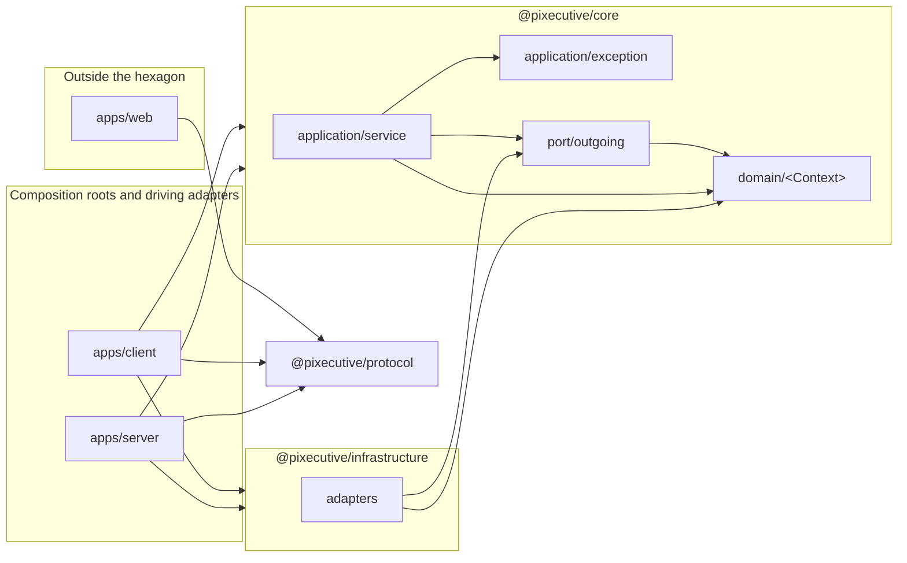

# ADR 0011 — Strict hexagonal architecture: a framework-free core, adapters in their own package, apps as roots

<!-- STATE:BEGIN — generated by scripts/generate-adr-state.ts from the frontmatter; never edit by hand. -->

|                     |                                                                        |
| ------------------- | ---------------------------------------------------------------------- |
| **Status**          | accepted                                                               |
| **Date**            | 2026-10-03                                                             |
| **Kind**            | architecture                                                           |
| **Decision-makers** | lradermacher                                                           |
| **Supersedes**      | —                                                                      |
| **Superseded by**   | —                                                                      |
| **Analysis**        | —                                                                      |
| **Implementation**  | [PLAN_PIX-1_claude-setup.md](../plans/impl/PLAN_PIX-1_claude-setup.md) |
| **Cards**           | —                                                                      |

<!-- STATE:END -->

> **In short.** In the context of a product with a server, a local client started with `npx` and a browser UI that
> share one domain, facing the risk that business rules leak into frameworks, databases and CLIs before the first
> package exists, we decided for a strict hexagon with a framework-free core, adapters in a separate package, apps as
> composition roots and a wire-contract package for the UI, and against a looser core and against path aliases, to
> achieve a domain that can be tested and bundled without its surroundings, accepting more files and mapping code at
> every edge.

## Context and problem

Pixecutive has three runnable parts: `apps/server`, `apps/client` (the `npx` client, a local web server plus a runner)
and `apps/web` (the browser UI). Server and client decide the same things about companies, offices, AI employees and
work, and they talk to the outside world in different ways: databases, files, processes, provider CLIs. No package
exists yet. Where the boundaries lie has to be decided before the first line of product code, because the first
package sets the pattern every later one copies.

## Decision drivers

- The domain must be testable with plain in-memory fakes, without a database, a framework or a network.
- The `npx` client has to be bundled from real workspace packages, not from path aliases that only the compiler knows.
- The browser UI needs the shapes of messages without pulling the domain into the browser.
- The server framework is not chosen yet; the core must not depend on that choice.

## Considered options

- **A — Strict hexagon:** framework-free core, adapters in their own package, apps as composition roots.
- **B — Loose variant:** the core contains framework modules and entities and injects adapters directly.
- **C — Shared `libs/` folders** joined by tsconfig path aliases instead of workspace packages.

## Decision

Chosen: **A**, because only a core without framework and IO can be tested in isolation and bundled into both the
server and the client unchanged.

1. **The core is framework-free.** `packages/core` (`@pixecutive/core`) holds `domain/<Context>/`,
   `application/service/`, `application/exception/` and `port/outgoing/`. It imports no framework, no
   `@pixecutive/infrastructure`, no app and no IO module.
   `[Planned PIX-7: Lint · Planned PIX-7: Hook architecture-guard]`
2. **Adapters live in their own package.** `packages/infrastructure` (`@pixecutive/infrastructure`) implements the
   outgoing ports. Persistence is a port like any other; no use case touches a database client.
   `[Planned PIX-7: Hook architecture-guard]`
3. **Apps are composition roots and driving adapters.** `apps/server` and `apps/client` wire ports to adapters and
   receive requests from HTTP, WebSocket or the command line. Wiring may use a dependency-injection container; where
   one binds a port, a token file names it. `[Planned PIX-7: Lint]`
4. **The browser UI stands outside the hexagon.** `apps/web` never imports the core. The wire contract between UI,
   client and server lives in `packages/protocol` as zod schemas of the messages. `[Planned PIX-7: Lint]`
5. **Ports are domain-typed.** A port speaks in domain types only; no port is generic over a persistence record.
   Adapters map with `toDomain`, and no persistence record leaves the infrastructure package.
   `[Agent adversarial-review]`
6. **Time and IDs come from outside the core.** Time comes through a clock port; IDs are generated in adapters. The
   core never reads the system clock or creates random values itself. `[Agent adversarial-review]`
7. **Errors are core exceptions with a key, translated at each edge.** An exception in `application/exception/`
   carries a key from an enum; HTTP, WebSocket and the command line each translate the same key into their own
   answer. `[Prose]`, because whether an edge translates every key is shown by that edge's tests, not by a static
   rule.
8. **Configuration enters at the app, secrets fail closed.** The core reads no environment. An app reads and
   validates its configuration at start; a missing secret stops the start instead of falling back to a default.
   `[Agent adversarial-review]`
9. **Names follow one scheme** (table below), so a file name tells its role and the guard can pair ports with their
   tokens and adapters. `[Planned PIX-7: Hook architecture-guard]`
10. **The first bounded contexts are Company, Office, Workforce, Work, Conversation, Runtime and Inbox.** A context
    folder is created when its first code arrives, and a domain model with its entity relationships is planned before
    any implementation. `[Prose]`, because a context boundary is a modelling judgment no check can make.

| Element | File | Exported name |
| --- | --- | --- |
| Port | `port/outgoing/<name>.interface.ts` | `I<Name>` |
| Token, only where a container binds the port | `<name>.token.ts` | token for `I<Name>` |
| Command | `<verb><Noun>Command.ts` | `<Verb><Noun>Command` |
| Use case | `application/service/<name>.service.ts` | `<Name>Service` |
| Adapter | `<port>-<technology>.adapter.ts` | `<Port><Technology>Adapter` |
| Value object | `domain/<Context>/valueObject/` | the value object |
| Enum | `*.enum.ts` | members `PascalCase = 'snake_case'` |
| Schema | `*.schema.ts` | the schema |

### Consequences

- Good, because use cases are tested with hand-written in-memory fakes of their ports.
- Good, because the client and the server bundle the same core from real packages.
- Good, because the choice of server framework stays open; the core does not know it.
- Bad, because every edge needs mapping code and every outgoing dependency needs a port and an adapter.
- Bad, because until PIX-7 the boundaries are stated by the core rule alone; no package exists that could break them.
- How AI employees reach a model through the runtime port is decided in
  [ADR 0012](0012-ai-employees-and-compute-sources.md).

### Confirmation

With the first package (PIX-7), the import zones are `no-restricted-imports` patterns that also catch `import()` and
`require()`, and a probe plants a forbidden import in the core and in `apps/web` to turn the lint red, then green
after removing it. The architecture guard runs on every write and rejects a port without its pair, an adapter
import in the core and an IO module in the core; its probe plants each case once. Until then, the core rule carries
these boundaries and loads for every file under `packages/` and the two hexagon apps.

## Mechanics

Allowed import directions between the parts this decision names. An arrow means "may import"; the core imports
no other workspace package, and `apps/web` imports no workspace package but the protocol.

## Rejected

- **B — Loose variant** with framework modules and entities in the core and adapters injected directly. The core
  could no longer be tested or bundled without the framework, and the framework choice would be made by accident.
- **C — `libs/` with tsconfig path aliases.** Bundling the `npx` client needs real packages with their own manifest;
  aliases exist only for the compiler.
- **The UI importing the core.** The domain would ship to the browser, and the UI would bind to internals instead of
  messages.
- **The UI mirroring every type by hand.** Copies drift silently; the protocol package gives one schema to both sides.
