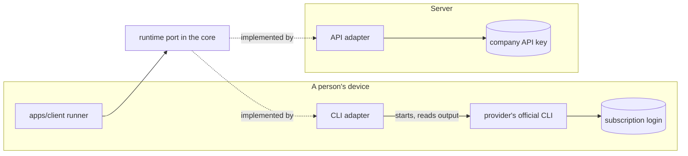

# ADR 0012 — AI employees are lasting office members; each run uses a person's subscription or a company API key

<!-- STATE:BEGIN — generated by scripts/generate-adr-state.ts from the frontmatter; never edit by hand. -->

|                     |                                                                        |
| ------------------- | ---------------------------------------------------------------------- |
| **Status**          | accepted                                                               |
| **Date**            | 2026-10-03                                                             |
| **Kind**            | architecture                                                           |
| **Decision-makers** | lradermacher                                                           |
| **Supersedes**      | —                                                                      |
| **Superseded by**   | —                                                                      |
| **Analysis**        | —                                                                      |
| **Implementation**  | [PLAN_PIX-1_claude-setup.md](../plans/impl/PLAN_PIX-1_claude-setup.md) |
| **Cards**           | —                                                                      |

<!-- STATE:END -->

> **In short.** In the context of an office in which people and AI employees work together, facing the question of
> what an AI employee is and whose compute pays for its work, we decided for AI employees as lasting members whose
> runs are started by a person with one of two compute sources, a personal subscription through the provider's
> official CLI on that person's device or a company API key on the server, behind one runtime port, and against an
> agent SDK everywhere, server-only keys or subscriptions only, to achieve that people can use what they already pay
> for without Pixecutive ever touching their logins, accepting that a run on a device pauses when the device goes
> offline.

## Context and problem

Pixecutive is a shared office for people and AI employees. An AI employee has to persist between pieces of work, so
the office can show who it is and what it is doing. The compute that drives it can come from different places: many
people already hold a personal subscription with a model provider, used through that provider's official CLI on
their own device, and a company may hold an API key for the server. Both must be possible without Pixecutive handling
anyone's subscription login, and without one person controlling every AI employee by default.

## Decision drivers

- A subscription login is personal and must never leave the device it belongs to.
- People should be able to use the subscription they already pay for, including the local tools around it.
- Everyone in the office must see who is behind a run, with what, and on which task.
- Control over an AI employee is given, not assumed.
- The domain must not depend on any one provider or CLI.

## Considered options

- **A — Lasting AI employees, runs with one of two compute sources, one runtime port.**
- **B — An agent SDK everywhere** that drives every run, also with personal subscriptions.
- **C — Server-only API keys:** every run on the server, paid by the company.
- **D — Subscriptions only:** every run on a person's device.

## Decision

Chosen: **A**, because it is the only option that keeps personal logins on their device and still lets a company run
work on the server.

1. **An AI employee is a lasting member of the office.** It has a role, its own markdown files and a desk. It exists
   between runs. `[Prose]`, because the domain model of [ADR 0011](0011-hexagonal-architecture.md) is planned before
   any code exists and then carries this definition.
2. **A run is one piece of work.** A person sends an AI employee to a task and chooses a compute source for that run.
   `[Prose]`, for the same reason.
3. **There are two compute sources.** A person's own subscription runs on that person's device through the provider's
   official CLI; the login never leaves the device, and the run pauses while the device is offline. A company API key
   runs on the server. `[Prose]`, because no runtime exists yet; the implementation plan of the first runtime card
   turns this into tests.
4. **Every run is visible.** Clicking an AI employee shows who started the current run, with which compute source,
   which AI and model, and on which task. `[Prose]`, until the code that shows it has tests that carry it.
5. **Nobody controls every AI employee by default.** A person controls their own AI employees and those they were
   given access to. `[Prose]`, until the access rules exist as code with their tests.
6. **One runtime port, one adapter per source.** The core defines a single runtime port; each provider CLI gets its
   own adapter, and the API gets one. The core never knows which provider or CLI runs a task.
   `[Planned PIX-7: Hook architecture-guard · Planned PIX-7: Lint]`
7. **The providers' terms are checked before any runtime work.** Whether a provider allows its CLI to be driven this
   way is checked and recorded as its own ADR before the first runtime card is built; that ADR is a prerequisite of
   the card's implementation plan. `[Hook require-ticket]`
8. **Pixecutive never reads a subscription login.** Only the provider's official CLI touches it; Pixecutive starts the
   CLI and reads its output. `[Agent adversarial-review]`

### Consequences

- Good, because people use the subscription they already have, on their own device, with their own tools.
- Good, because the company decides separately whether it pays for server runs with an API key.
- Good, because a new provider is one more adapter, not a change to the core.
- Bad, because a run on a personal subscription depends on that device being online and pauses otherwise.
- Bad, because each provider CLI behaves differently, so each adapter needs its own tests.
- Bad, because the runtime cannot start until the terms check is recorded.

### Confirmation

Until the first runtime card, this decision is carried by its prerequisites: `require-ticket` blocks building
without an approved implementation plan, and that plan names the terms ADR. Once the runtime port exists, the
architecture guard rejects a runtime adapter imported into the core, and the independent review before every pull
request checks every runtime adapter for access to a provider's login.

## Mechanics

Where each compute source runs and what crosses the device boundary.

## Rejected

- **B — An agent SDK everywhere.** It conflicts with the rule that only the provider's official CLI touches a
  subscription login.
- **C — Server-only API keys.** People would lose their personal subscriptions and the local tools around them.
- **D — Subscriptions only.** A company could not run work on the server, and nothing would run while every device
  is offline.
- **One person controlling every AI employee by default.** Access is given per AI employee, never assumed.
