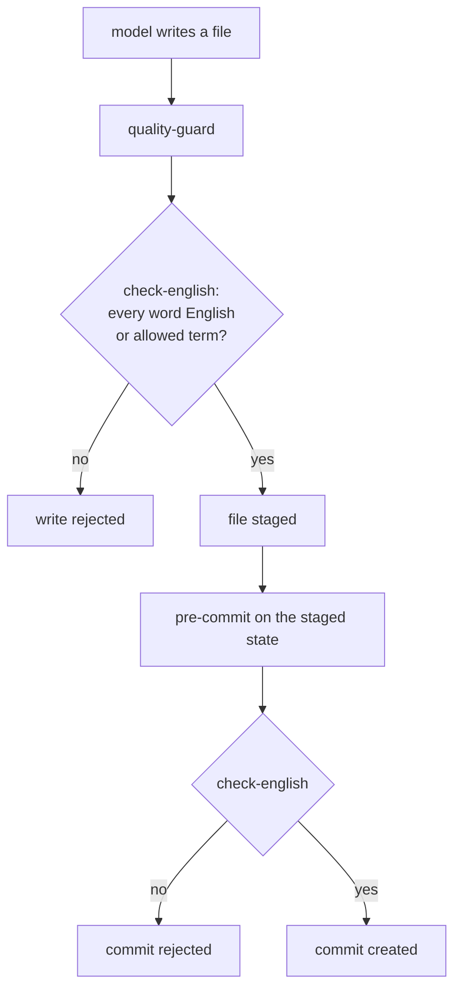

# ADR 0014 — Everything in the repo is English, and identifiers consist of English words or allowed technical terms

<!-- STATE:BEGIN — generated by scripts/generate-adr-state.ts from the frontmatter; never edit by hand. -->

|                     |                                                                        |
| ------------------- | ---------------------------------------------------------------------- |
| **Status**          | accepted                                                               |
| **Date**            | 2026-10-04                                                             |
| **Kind**            | workflow                                                               |
| **Decision-makers** | lradermacher                                                           |
| **Supersedes**      | —                                                                      |
| **Superseded by**   | —                                                                      |
| **Analysis**        | —                                                                      |
| **Implementation**  | [PLAN_PIX-1_claude-setup.md](../plans/impl/PLAN_PIX-1_claude-setup.md) |
| **Cards**           | —                                                                      |

<!-- STATE:END -->

> **In short.** In the context of a public open-source repo that people and Pixecutive instances anywhere should be
> able to read and extend, facing a maintainer who works in German and a model that drifts into the language of the
> conversation, we decided for English in everything the repo holds, with identifiers checked against English words
> and allowed technical terms, and against a check that only looks for German words, to achieve a repo that every
> contributor and every agent can read, accepting a word list to maintain and a check that sometimes needs a new term.

## Context and problem

The conversation with the maintainer happens in German, and a model writing code from that conversation carries
German into names, comments and commit messages unless something stops it. A repo that mixes languages cannot be read
by most contributors, and an agent of a Pixecutive instance working in it would inherit the mix. A check that searches
for German words catches only the words on its list; every other language, every misspelling and every invented
abbreviation passes.

## Decision drivers

- The repo is public; its readers and contributors are not bound to any one language.
- A Pixecutive instance must be able to develop Pixecutive from the repo alone, so its language must be the one
  agents and people share most widely.
- A check must say what is allowed, not guess what is forbidden; a list of forbidden words is never complete.

## Considered options

- **A — English everywhere; identifiers must be English words or allowed technical terms.**
- **B — English everywhere; identifiers checked against a list of German words.**
- **C — English code, documentation in the maintainer's language.**

## Decision

Chosen: **A**, because only an allow list gives a clear answer for every identifier, whatever language it drifted
from.

1. **Everything in the repo is English.** Code, identifiers, file names, comments, documentation, rules, skills,
   commit messages, tickets and pull requests. Only the conversation with the maintainer is in German, and nothing
   from it enters the repo untranslated. `check-english` reads comments, strings and documentation as well as names,
   so a German sentence fails like a German identifier; whether the English is good is left to the independent
   review. `[Gate check-english · Agent adversarial-review]`
2. **Every word must be English or an allowed technical term.** `check-english` runs CSpell, which splits identifiers
   into their words and checks each one against its English and software-term dictionaries and the project's own list
   of allowed terms in `.cspell/project-words.txt`. Words shorter than three letters are not checked. File names are
   checked by passing the changed paths to CSpell as text. The tool and its measured version are recorded in
   [ADR 0007](0007-tooling.md). `[Gate check-english]`
3. **The check runs on every write.** `quality-guard` runs `check-english` on each file the model writes, so a wrong
   name is rejected before the next step builds on it. `[Hook quality-guard]`
4. **The check runs again on the staged state.** `check-english` is registered as a gate in pre-commit, so a file
   written outside a Claude session is checked too. `[Hook pre-commit · Gate check-english]`

### Consequences

- Good, because every reader and every agent meets one language in every file.
- Good, because the check also catches abbreviations and words from any other language, not only German.
- Bad, because the list of allowed technical terms has to be maintained, and a new library name or acronym fails
  until it is added.
- Bad, because the gate checks words, not grammar or style; that stays with the review.
- Where the rule itself lives is decided by [ADR 0001](0001-one-carrier-per-rule.md); the boundary between public
  and private records by [ADR 0015](0015-self-sufficient-public-repo.md).

### Confirmation

The probe of `check-english` plants an identifier, a comment and a file name with a German word, and an invented
abbreviation, and the gate turns red on each, naming file and line; it turns green on the same file with English
names. The probe is registered in `.claude/data/precommit-checks.tsv`, so pre-commit rejects the gate if the probe is
missing.

## Mechanics

Where the identifier check runs.

## Rejected

- **B — A list of German words.** It catches only the words someone thought of; other languages, misspellings and
  invented abbreviations pass.
- **C — English code with documentation in the maintainer's language.** Most contributors could not read the
  decisions and rules, and an agent of another instance would work from documents it cannot rely on.
