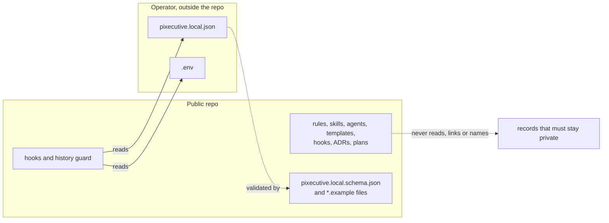

# ADR 0015 — The public repo is self-sufficient: a Pixecutive instance can develop Pixecutive from it alone

<!-- STATE:BEGIN — generated by generate-adr-state from the frontmatter. Do not edit by hand. -->
<!-- STATE:END -->

> **In short.** In the context of an open-source product that is meant to be developed by its own instances, facing
> records that must stay private and the pull of linking to them from rules, skills and plans, we decided for a public
> repo that holds everything needed to develop Pixecutive and depends on nothing outside it except operator values,
> and against any public reference to private records or other projects, to achieve a repo that any contributor or
> Pixecutive instance can work from, accepting that private context has to be restated in public terms or left out.

## Context and problem

Pixecutive should be developable by a Pixecutive instance: its AI employees check out this repo and work under its
rules, skills and hooks like any other contributor. That only works if everything they need is in the repo. At the
same time there are records that must stay private: business matters, the build-in-public series, the operation of
one particular instance. A rule, skill or plan that points to such a record works for the maintainer and
fails for everyone else, and a name that slips into the history stays there for good.

## Decision drivers

- An agent of any instance must be able to follow every rule and link it finds in the repo.
- A private name that enters the public history cannot be removed from it.
- Values that differ per operator are needed by the hooks, but they are not part of the product.
- What keeps this boundary has to be a mechanism, because a slip is easy and invisible in the moment.

## Considered options

- **A — Self-sufficient public repo;** operator values from outside, private records never named.
- **B — Public repo that links to private records** for context that only the maintainer can open.
- **C — Public repo that reads some of its configuration from another repository** checked out next to it.

## Decision

Chosen: **A**, because it is the only option under which an instance with nothing but this repo can develop
Pixecutive.

1. **Everything needed to develop Pixecutive lives in this repo.** Rules, skills, agents, templates, hooks, ADRs,
   product plans and implementation plans. A link from any of them resolves inside the repo.
   `[Gate reference check, PIX-8]`
2. **Nothing public reads from, links to or requires records that must stay private.** No rule, skill, plan, hook or
   script opens, names or points to them, and no public file names another project of the maintainer. A rule states
   the rule itself, never where it was learned. The history
   guard rejects every denylisted string before a commit exists and again before a push.
   `[Hook pre-commit · Hook pre-push]`
3. **Operator-private values come from outside the repo.** Structured values from the gitignored local config,
   single values and secrets from `.env`, as decided in [ADR 0013](0013-local-operator-configuration.md). The repo
   ships only their schema and examples. `[Config pixecutive.local.schema.json]`
4. **Decisions recorded here are the ones someone working on Pixecutive needs.** Decisions about business, the
   build-in-public series or the operation of one particular instance are not recorded in this repo, and no ADR
   names or links where they are. `[Prose]`, because whether a decision belongs here is a judgment; the denylist
   catches only the names.

### Consequences

- Good, because any contributor and any instance can follow every link and rule in the repo.
- Good, because a private name is stopped before it reaches the history, not found after.
- Bad, because context from private records has to be restated in public terms, or left out where it cannot be.
- Bad, because the denylist lives in each operator's local config: a checkout without it checks only secrets and
  general patterns, not private names.
- Bad, because until the reference check arrives with PIX-8, a link that leaves the repo is caught by review, not by
  a gate.
- The language of the repo is decided in [ADR 0014](0014-english-everywhere.md).

### Confirmation

The pre-commit and pre-push probes run with a temporary local config, plant a denylisted string in a staged file and
in a pushed commit, and turn red with file, line and category, never the matched text; they turn green once the
string is removed. With PIX-8, the reference check gets a probe that plants a link to a path outside the repo and
turns red on it.

## Mechanics

What may cross the boundary of the public repo, and in which direction.

## Rejected

- **B — Linking to private records.** Every link would work for the maintainer and fail for every other contributor
  and every instance.
- **C — Reading configuration from another repository.** The public repo would no longer run on its own, and the
  path to that repository would itself be a private value in public code.
