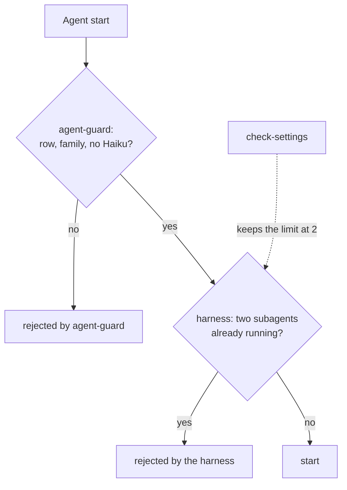

# ADR 0017 — The harness holds the limit of two agents

<!-- STATE:BEGIN — generated by scripts/generate-adr-state.ts from the frontmatter; never edit by hand. -->

|                     |                                                                               |
| ------------------- | ----------------------------------------------------------------------------- |
| **Status**          | accepted                                                                      |
| **Date**            | 2026-10-04                                                                    |
| **Kind**            | workflow                                                                      |
| **Decision-makers** | lradermacher                                                                  |
| **Supersedes**      | [0009](0009-models-and-agents.md) (point 4 only; the rest of ADR 0009 stands) |
| **Superseded by**   | —                                                                             |
| **Analysis**        | —                                                                             |
| **Implementation**  | [PLAN_PIX-1_claude-setup.md](../plans/impl/PLAN_PIX-1_claude-setup.md)        |
| **Cards**           | PIX-1                                                                         |

<!-- STATE:END -->

> **In short.** In the context of the limit of two subagents at once, facing a counter of our own that could not
> tell which agent stopped and kept entries of starts that failed, we decided to let the harness's own limit hold
> the number and against repairing our counter, to count agents where they are started and stopped, accepting that
> the limit now rests on a setting that a gate has to keep in place.

## Context and problem

ADR 0009 point 4 limits a session to two subagents at once and names its mechanism: `agent-guard` counts every start,
`agent-done` counts down on `SubagentStop`. Measured on 2026-10-04, the counter drifts in two ways. `SubagentStop`
does not say which agent stopped, so `agent-done` strikes the oldest entry by guess. A start that fails after
`agent-guard` passed it, such as an unknown agent type, is counted, but no stop ever follows, so its entry stays until
it expires. The counter then held two entries while one agent ran and rejected a real start.

The harness has its own limit, `CLAUDE_CODE_MAX_CONCURRENT_SUBAGENTS`, set to 2 in `.claude/settings.json`. Measured
in the same session, it rejects a third start ("Concurrent subagent limit reached"). It starts and stops the agents
itself, so it cannot lose count.

## Decision drivers

- The limit of two is about cost and must hold without anyone remembering it.
- A guard that rejects a start without cause blocks ordered work.
- What counts the agents must see every start and every stop.

## Considered options

- **A — The harness limit holds the number; our counter goes.**
- **B — Keep our counter with a shorter expiry.**

## Decision

Chosen: **A**, because only the harness sees which agent stopped and which start never began.

1. **At most two subagents run at the same time, held by the harness.** `CLAUDE_CODE_MAX_CONCURRENT_SUBAGENTS` is `2`
   in `.claude/settings.json`, and `check-settings` rejects a settings file without it or with another value.
   `agent-guard` keeps checking the family of every start (ADR 0009 points 1 to 3) and counts nothing.
   `[Gate check-settings · Hook agent-guard]`

### Consequences

- Good, because a failed start or a stop no longer leaves a wrong count behind.
- Good, because one hook and three subcommands of `ticket.ts` fewer have to be kept correct.
- Bad, because the limit depends on a harness setting; `check-settings` keeps it in place, and the minimum CLI
  version in `.claude/MIN_CLI.md` names it.

### Confirmation

`probe-hooks` turns `check-settings` red when the limit is missing or lifted, and shows that `agent-guard` passes three
starts in a row with a correct family, so it no longer counts. This replaces the counter parts of ADR 0009's
Confirmation and Mechanics; its checks of the family stand.

## Mechanics

What is checked when an agent starts; it replaces the counter steps in the diagram of ADR 0009.

## Rejected

- **B — keep our counter with a shorter expiry.** It would still guess which agent stopped; a shorter expiry only
  shortens how long a wrong count blocks.
