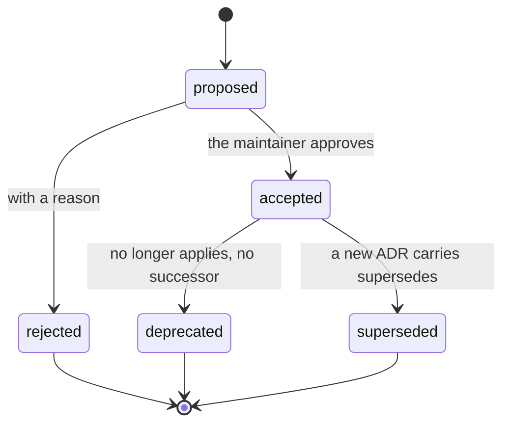

# Architecture decision records

An ADR records **one** decision: what was decided, why, and how you can tell it is kept. It is not a plan
(`docs/plans/`), not an analysis (`docs/research/`).

Template: [TEMPLATE.md](TEMPLATE.md).

## Which decisions are recorded here

Every decision that someone working on Pixecutive needs: architecture, technology, ways of working. Decisions about
business, the build-in-public series or the operation of one particular instance are not recorded in this repo, and
no ADR here names or links where they are.

## Lifecycle

This diagram stands here and only here. The state of a single ADR is shown by its state table.

## The rules

**One decision per ADR.** If the question cannot be asked in one sentence, it is two ADRs. A coherent ADR is not split
because of its length.

**An ADR is not changed, it is superseded.** A changed decision becomes a new ADR with `supersedes: [N]`; the old one
gets `status: superseded` and `superseded-by: M`. Fixing typos and metadata is allowed.

**Rejected is required.** An ADR names what did not survive. An empty section means the old was carried over instead
of judged.

**The kind is one of three words:** `architecture` · `technology` · `workflow`.

**The status is one of five words:** `proposed` · `accepted` · `rejected` · `deprecated` · `superseded`.

**The state table is generated from the frontmatter.** `generate-adr-state` writes the table between `STATE:BEGIN`
and `STATE:END`; pre-commit rejects a table that differs.

**Every decision point names its mechanism** in brackets: `[Hook]` `[Lint]` `[Gate]` `[Skill]` `[Agent]` `[Config]`
`[Prose]`. An ADR whose points are all `[Prose]` decided nothing; `[Prose]` says why no mechanism is possible.

**Length is a guide, not a limit.** Around 90 lines of prose, without frontmatter, tables and diagrams. Clearly more
is a reason to check whether it is still one subject.

## Format

Based on MADR 4.0.0: the frontmatter keys `status`, `date`, `decision-makers`, `consulted`, `informed` are taken
verbatim so tools can read them. `kind`, `supersedes`, `superseded-by`, `analysis` and `implementation` are this
repo's extensions. The one-sentence summary is a Y-statement (Zdun et al., IEEE Software 2013).

## When a diagram belongs in

| `kind` | Diagram | Why |
| --- | --- | --- |
| `workflow` | expected | A procedure is a graph: states, transitions, branches. |
| `architecture` | only for boundaries and directions | Layers, zones and allowed import directions. |
| `technology` | usually none | A choice of tool is a comparison, and that is the options table. |

Allowed types: `flowchart`, `sequenceDiagram`, `stateDiagram-v2`, `classDiagram`, `erDiagram`. ⛔ No system overview,
no comparison of options, no timeline.

Two traps: ` ` in a transition label of a `stateDiagram-v2` breaks the diagram, and so does a non-ASCII state ID
(use `state "label" as id`).
